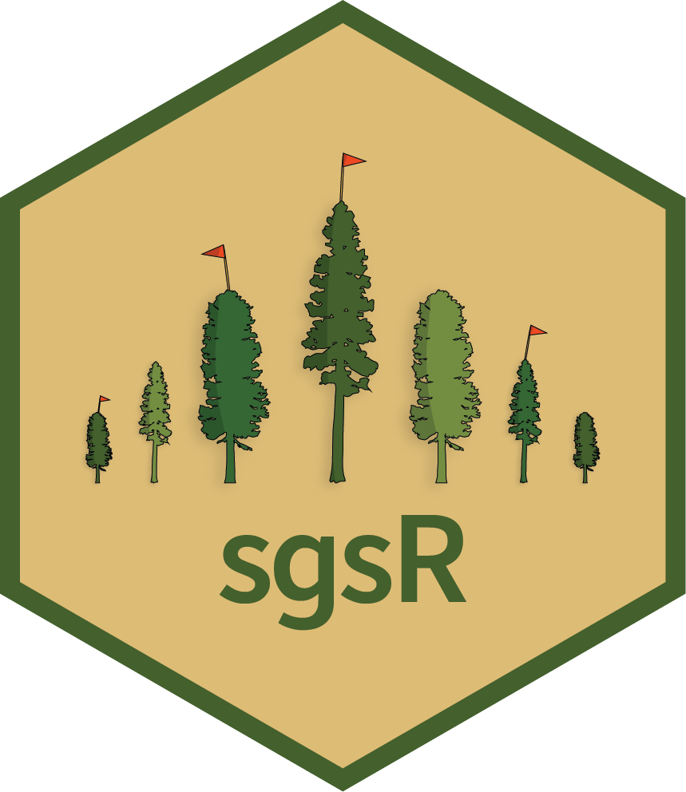

<!-- README.md is generated from README.Rmd. Please edit that file -->

# sgsR - structurally guided sampling 

<!-- badges: start -->


[](https://github.com/tgoodbody/sgsR/actions)
[](https://app.codecov.io/gh/tgoodbody/sgsR?branch=main)
[](https://CRAN.R-project.org/package=sgsR)
<!-- badges: end -->

## Installation :computer:

Install the stable version of [`sgsR`from
CRAN](https://cran.r-project.org/package=sgsR) with:

``` r
install.packages("sgsR")
library(sgsR)
```

Install the most recent development version of [`sgsR` from
Github](https://github.com/tgoodbody/sgsR) with:

``` r
install.packages("devtools")
devtools::install_github("https://github.com/tgoodbody/sgsR")
library(sgsR)
```

## Overview

`sgsR` provides a collection of stratification and sampling algorithms
that use auxiliary information for allocating sample units over an areal
sampling frame. ALS metrics, like those derived from the [`lidR`
package](https://cran.r-project.org/package=lidR) are the intended
inputs.

Other remotely sensed or auxiliary data can also be used (e.g. optical
satellite imagery, climate data, drone-based products).

`sgsR` is being actively developed, so you may encounter bugs. If that
happens, [please report your issue
here](https://github.com/tgoodbody/sgsR/issues) by providing a
reproducible example.

## Example usage :bar_chart:

``` r
#--- Load mraster files ---#
r <- system.file("extdata", "mraster.tif", package = "sgsR")

#--- load the mraster using the terra package ---#
mraster <- terra::rast(r)

#--- apply quantiles algorithm to mraster ---#
sraster <- strat_quantiles(mraster = mraster$zq90, # use mraster as input for stratification
                           nStrata = 4) # produce 4 strata
                        
#--- apply stratified sampling ---#
existing <- sample_strat(sraster = sraster, # use sraster as input for sampling
                         nSamp = 200, # request 200 samples
                         mindist = 100, # samples must be 100 m apart
                         plot = TRUE) # plot output
```

## Resources & Vignettes :books:

Check out [the package
documentation](https://tgoodbody.github.io/sgsR/index.html) to see how
you can use `sgsR` functions for your work.

`sgsR` was presented at the ForestSAT 2022 Conference in Berlin. [Slides
for the presentation can be found
here.](https://tgoodbody.github.io/sgsR-ForestSAT2022/)

## Collaborators :woman: :man:

We are thankful for continued collaboration with academic, private
industry, and government institutions to help improve `sgsR`. Special
thanks to to:

| Collaborator                                                                                                  | Affiliation                                                                       |
|:--------------------------------------------------------------------------------------------------------------|:----------------------------------------------------------------------------------|
| [Martin Queinnec](https://www.researchgate.net/profile/Martin-Queinnec)                                       | University of British Columbia                                                    |
| [Joanne C. White](https://scholar.google.ca/citations?user=bqjk4skAAAAJ&hl=en/)                               | Canadian Forest Service                                                           |
| [Piotr Tompalski](https://scholar.google.ca/citations?user=RtYdz0cAAAAJ&hl=en/)                               | Canadian Forest Service                                                           |
| [Andrew T. Hudak](https://www.fs.usda.gov/rmrs/people/ahudak/)                                                | United States Forest Service                                                      |
| [Ruben Valbuena](https://scholar.google.com/citations?user=Nx336TQAAAAJ&hl=en/)                               | Swedish University of Agricultural Sciences                                       |
| [Antoine LeBoeuf](https://scholar.google.com/citations?user=wGsKOK8AAAAJ&hl=en/)                              | Ministère des Forêts, de la Faune et des Parcs                                    |
| [Ian Sinclair](https://ca.linkedin.com/in/ian-sinclair-984929a4/)                                             | Ministry of Northern Development, Mines, Natural Resources and Forestry           |
| [Grant McCartney](https://www.signalhire.com/profiles/grant-mccartney%27s-email/99719223/)                    | Forsite Consultants Ltd.                                                          |
| [Jean-Francois Prieur](https://www.researchgate.net/scientific-contributions/Jean-Francois-Prieur-2142960944) | Université de Sherbrooke                                                          |
| [Murray Woods](https://www.researchgate.net/profile/Murray-Woods)                                             | (Retired) Ministry of Northern Development, Mines, Natural Resources and Forestry |

## Funding :raised_hands:

Development of `sgsR` was made possible thanks to the financial support
of the Canadian Wood Fibre Centre’s Forest Innovation Program.
